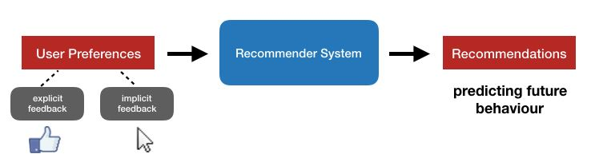

# Recommender System 

We all are influenced by the recommender system to different degrees, if we are using social media, making an online purchase or consuming content from streaming platforms. Recommender systems engage the user by providing them with personalized choices based on their past behaviour. 
 
It’s a very hot topic in e-commerce, it has changed the way we sell things, we have unlimited inventory, the products we previously neglected in the stores are assessable to the customers now online.  
Under the hood, a recommender system is a learning algorithm that learns from past preferences to predict the future behaviour of the user. 
Some example from real-life are: Amazon, Netflix, LinkedIn, Spotify, OkCupid, New York Times, GitHub, Medical (Facilitating clinical decision making)

### Motivation
Now customer’s mindset is - 

***“I want a black T-shirt! There must be four different fits of five brands in four different fabrics on this website! Choices are good! I know!  Let me quit my job and devote my life to choosing a Black T-shirt! I will compare the fabric! I will compare the brands! I will check if their sizes are true to the fit and I will compare the prices! Maybe I will check on other websites and see what they have to offer! “***

Offering a plethora of selection options doesn’t necessarily mean a customer will buy more stuff. More options do attract customers but they get lost with the options and lose their motivation to make a purchase.  Instead, when providing with personalized options, chances are high that customer will buy the product.  Recommender system provides personalized recommendations that ease the heavy load of choices by reducing the search space and identifying the most relevant and quality product for the user. 

### Goal
To build a Recommender system capable of making recommendations in a sensible way.

## Working of Recommender System

explicit feedback: direct feedback towards an item (e.g., movie ratings) 
implicit feedback: indirect behaviour towards an item (e.g., purchase history, time spent on product page, search behaviour)

### Content Based 
We assume that features of the different products available to us. These features tells us to what degree a product falls into a certain category.

### Colaborative Filtering
It is impossible to have features of all the products we are selling so in that case Collaborative filtering is used. This algorithm has an interesting property called feature learning, it learn for itself what features to use.

## Data
The sample dataset contains jumbled [Google Analytics 360 data](https://console.cloud.google.com/marketplace/product/obfuscated-ga360-data/obfuscated-ga360-data?filter=solution-type:dataset) from the Google Merchandise Store, a real ecommerce store, for the period of 1-Aug-2016 to 1-Aug-2017. This dataset is hosted publicaly on Bigquery.

It includes the following kinds of information:

Traffic source data: information about where website visitors originate. This includes data about organic traffic, paid search traffic, display traffic, etc.
Content data: information about the behavior of users on the site. This includes the URLs of pages that visitors look at, how they interact with content, etc.
Transactional data: information about the transactions that occur on the Google Merchandise Store website.

Orignal dataset contains total of 366 tables, one table for each day. Each row of the table represents a session and columns contains the detailed information about the session. Details on table schema and columns can be found here [BigQuery table schema](https://support.google.com/analytics/answer/3437719?hl=en)
